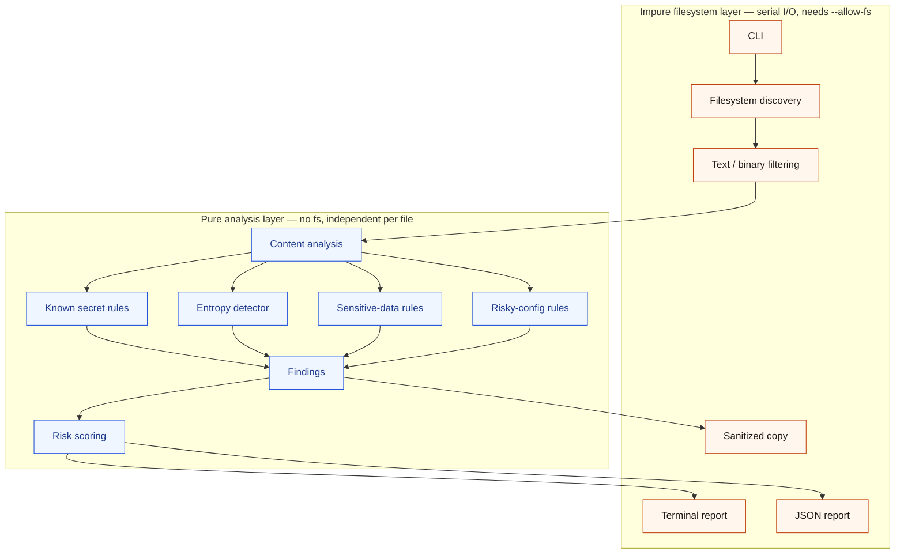

# SafeShare J2

A local-first scanner that looks for secret-shaped strings, credentials, and a few risky config flags in a directory **before** you zip the tree or paste it into an AI assistant.

SafeShare is **not** a replacement for enterprise secret-scanning products (GitHub Advanced Security, TruffleHog-in-CI, cloud DLP, and the rest). It is a small, readable J2 program you run on a laptop: lightweight, local-first, zero-network, and transparent about being a heuristic.

## Problem

People share source trees constantly — with teammates, with contractors, and with ChatGPT, Claude, Gemini, Cursor, and Copilot. The dangerous files are ordinary: `.env`, `docker-compose.yml`, `AGENTS.md`, a JWT pasted into `app.ts` “just for local testing.”

Hosted scanners assume a git host, a SaaS account, and a network. They are the wrong tool for “I am about to paste this folder into a chat in two minutes.” A missed secret in that paste is already gone. A false “all clear” is worse than a noisy warning.

## Solution

SafeShare walks a directory you name, reads text files (size-capped), and runs a compiled-in table of regular expressions plus a Shannon-entropy heuristic. It prints a terminal report and, optionally, JSON.

Findings never store a complete secret — only a length-preserving mask and a SHA-256 fingerprint of `(rule_id, raw)`. JSON `safe_to_share` is always `false`. An empty scan prints that the miss is **not a guarantee**. The share line is `NO` when credential-shaped hits exist, otherwise `not guaranteed` — never `YES`.

`sanitize` writes a sibling copy with a handful of high-confidence patterns replaced by `[SAFESHARE_REDACTED]`. Heuristic hits are copied through on purpose; the report says so.

## Why J2?

[J2](https://j2-lang.org/) is a small language with deny-by-default capabilities, an interpreter and a native compiler on the same source, and automatic parallelism for pure loops the compiler can prove independent. There is no package manager and no network at build time.

That matches this problem:

- SafeShare **must** read files. J2 withholds `fs` until you pass `--allow-fs` on **`j2`** (`j2 --allow-fs src/main.j2 …`).
- SafeShare **must not** talk to the network. Never pass `--allow-net`. A downloaded script cannot quietly exfiltrate a `.env`.
- Detectors are pure functions of `(path, text)`. Native `j2 build` may split independent per-file analysis across cores without a thread API in this repo.
- Judges (and you) can read every rule in `src/rules.j2`. Nothing is a black-box model.

J2 0.1.0’s public toolchain is **macOS on Apple Silicon**. This repo is the program; it does not vendor a runtime.

## Features

- **Scan** a directory or a single file. Default max text size is 1 MB per file; binaries and NUL-containing buffers are skipped.
- **Terminal report** with severity, mask, recommendation, and a 0–100 risk score (diminishing returns so 100 `DEBUG=true` hits cannot look like an incident).
- **JSON report** (`--json FILE`) built as maps, then `json.stringify_pretty` — not string-concatenated JSON.
- **`--ai-share`** highlights paths people commonly paste into assistants (`.env`, Markdown, `.cursor/`, `.github/`, …).
- **`.safeshareignore`** — a small, documented subset of gitignore (not `**`, not negation). Built-in skips include `.git/`, `node_modules/`, `dist/`, and the like.
- **Sanitize** — copy text to a destination **outside** the source tree; redact only AWS key ids, GitHub tokens, PEM private-key blocks, and database URLs with userinfo. Never `fs.copy` (that can copy a symlink that still points at a secret).
- **Synthetic corpus** — `generate-corpus` / `evaluate` / `benchmark` for detector scoring and interpreter-vs-native timing. Embedded credentials are published examples or dummy alphabets, marked unusable.

## Demo

`demo-project/` is a two-minute fixture: five findings, not a wall of noise. Every credential is synthetic.

```sh
j2 --allow-fs src/main.j2 scan ./demo-project --ai-share
```

| Severity | File | What it is showing |
| --- | --- | --- |
| CRITICAL | `.env` | AWS access key **id shape** (AWS documentation example, not a live key) |
| HIGH | `src/app.ts` | unsigned `alg=none` JWT in source |
| HIGH | `src/config.ts` | TLS verification turned off |
| MEDIUM | `src/config.ts` | CORS set to `*` |
| LOW | `docker-compose.yml` | `DEBUG=true` |

Share verdict: **NO**. Details: [`demo-project/README.md`](demo-project/README.md).

## Installation

1. Install **J2 0.1.0** (macOS, Apple Silicon): [docs](https://j2-lang.org/docs/), [download](https://j2-lang.org/download.html), [releases](https://github.com/JasnamSinghArora/j2/releases).

```sh
j2 --version
# j2 0.1.0
```

2. Clone this repository and work from its root. J2 has no package manager; `import` splices source files into one program.

First scan (more commands in [How to use](#how-to-use)):

```sh
j2 --allow-fs src/main.j2 scan ./demo-project --ai-share
```

Test suite:

```sh
make test
# or: sh scripts/ci/run-tests.sh
```

Each `tests/*_test.j2` is a program of `assert_eq` checks, run with `j2 run` (interpreter). J2 0.1.0’s `j2 test` reports `FAIL file.j2 ()` with no diagnostic on this tree, so CI does not use it. Imports resolve through `tests/lib` → `src` (and `J2_PATH=src`): J2 looks next to the file, then that file’s `lib/`, then `J2_PATH` — not `../src`. Tests are pure: they do not call `fs` and do not need `--allow-fs`. Do not run `src/main.j2` under the test runner — that file **is** the CLI and runs at load.

## How to use

Commands assume the repository root, **J2 0.1.0**, and macOS Apple Silicon. `--allow-fs` is a flag on **`j2`**, before `src/main.j2` — not an argument to SafeShare. `j2 run --allow-fs src/main.j2 …` is the same grant. Never pass `--allow-net`.

### Scan

A bare path defaults to `scan`.

```sh
j2 --allow-fs src/main.j2 scan ./demo-project --ai-share
j2 --allow-fs src/main.j2 scan ./your-project
j2 --allow-fs src/main.j2 ./your-project
```

Make shortcuts (same interpreter grant):

```sh
make scan
make scan SCAN=./your-project
make scan SCAN=./your-project JSON=safeshare-report.json
make help
```

| Flag | Meaning |
| --- | --- |
| `--ai-share` | Highlight paths people commonly paste into assistants |
| `--json FILE` | Write a JSON report (maps, then `json.stringify_pretty`) |
| `--max-bytes N` | Per-file text cap (default 1 MB) |
| `--exclude PATTERN` | Extra ignore glob; repeatable |

Without `--allow-fs`, the runtime will not read files (`j2 src/main.j2 scan ./demo-project`).

### Sanitize

`DEST` must be a sibling or absolute folder **outside** the source tree (not `.`, `..`, or inside `PATH`).

```sh
j2 --allow-fs src/main.j2 sanitize ./demo-project --output ./demo-project-safe
make sanitize
make sanitize SCAN=./your-project OUTPUT=./your-project-safe
```

Only AWS key ids, GitHub tokens, PEM private-key blocks, and database URLs with userinfo are replaced. Heuristic hits are copied through on purpose. The copy is not “safe to share.”

### Corpus, evaluate, benchmark

Synthetic kit only. Do not treat F1 as production accuracy.

```sh
j2 --allow-fs src/main.j2 generate-corpus ./benchmark-corpus
j2 --allow-fs src/main.j2 evaluate ./benchmark-corpus
j2 --allow-fs src/main.j2 benchmark ./benchmark-corpus
```

`evaluate` is also accepted as `score`. `--trials`, `--warmup`, and `--json FILE` apply to `benchmark`. See [Benchmark](#benchmark).

### Native compile

```sh
j2 build src/main.j2 -o safeshare
./safeshare --help
make build
```

`j2 build` proves the source compiles. The binary stays deny-by-default: `--help` works; `./safeshare scan PATH` cannot read files. Scan with the interpreter (`j2 --allow-fs src/main.j2 scan PATH`). Do not set `J2_FORCE_NATIVE=1` on 0.1.0 — it drops SafeShare argv (prints usage, exit 2). SafeShare still strips leftover capability flags from `proc.argv()` so they are not taken as the scan root.

`make smoke` and `make self-scan` compile first, then scan through `j2 --allow-fs`, matching CI.

## CI

GitHub Actions (`.github/workflows/ci.yml`) runs on **macos-26** (hosted Apple Silicon). J2 0.1.0 is aarch64-darwin only; the install script exits if the runner is not `Darwin/arm64`. On every push and pull request it:

1. Installs J2 from the official [v0.1.0 tarball](https://github.com/JasnamSinghArora/j2/releases/tag/v0.1.0) (`j2-0.1.0-aarch64-apple-darwin.tar.gz`) after checking the published SHA-256.
2. Checks that committed `.j2` files match `j2 fmt` (stdout vs file; J2 0.1.0 has no `--check`).
3. Runs each `tests/*_test.j2` with `j2 run` (interpreter; see `scripts/ci/run-tests.sh`).
4. Compiles `j2 build src/main.j2 -o safeshare` (binary `--help`) and smokes `demo-project/` with `j2 --allow-fs src/main.j2 scan …` (JSON, five expected findings, no raw fixture secrets).
5. Self-scans the repo the same way (`scan . --ai-share`). Known synthetic trees are listed in `.safeshareignore` (`demo-project/`, `tests/`, …), not by weakening detectors.

Filesystem grant is `--allow-fs` only. Never `--allow-net`. Benchmarks are a separate manual workflow (`.github/workflows/benchmark.yml`); they are not a required PR check. GitHub-hosted timings are noisy and should not be quoted as product performance.

## Detection rules

Rules live in `src/rules.j2` (plus `high_entropy_string` in `src/entropy.j2`). Presence of a **shape** is not proof the credential is live.

**Higher confidence** (specific prefixes or PEM / DB URL userinfo):

| Id | Severity | Notes |
| --- | --- | --- |
| `aws_access_key_id` | critical | `AKIA` + 16 uppercase alphanumerics |
| `github_token` | critical | `ghp_` / `gho_` / … or `github_pat_` |
| `pem_private_key` | critical | `BEGIN … PRIVATE KEY` |
| `database_url_credentials` | critical | `scheme://user:pass@` |

**Heuristic credentials** (name=`value`, `sk-`, JWT, Bearer, entropy):

| Id | Severity |
| --- | --- |
| `openai_style_api_key` | high |
| `google_api_key` | high |
| `jwt_token` | high |
| `bearer_token` | high |
| `generic_password` | high |
| `generic_api_key` | high |
| `generic_secret_assignment` | high |
| `high_entropy_string` | medium |

Entropy requires length ≥ 24, ≥ 4.5 bits/char, mixed charset; hashes, UUIDs, and known prefixes are skipped. Placeholders such as `changeme` and `${VAR}` are ignored on the heuristic assignment rules.

**Risky configuration** (dotenv / YAML / JSON / Python / JS / TS / Docker-ish paths only):

| Id | Severity |
| --- | --- |
| `tls_verification_disabled` | high |
| `authentication_disabled` | high |
| `cors_wildcard` | medium |
| `debug_enabled` | low |
| `node_env_development` | low |

Sanitize redacts only the four higher-confidence ids. JWT, `sk-`, Bearer, generic passwords, and entropy hits are **copied into the output tree**.

## Capability security

J2 starts with no filesystem, process, or network rights. `fs.read_file` and `fs.list_dir` raise `RuntimeError` until you pass `--allow-fs`.

| Capability | SafeShare |
| --- | --- |
| `--allow-fs` | Required to walk and read the tree you named |
| `--allow-net` | **Do not pass.** There is no HTTP client in this program |
| `--allow-proc` | Not required (`proc.argv` / `proc.exit` are available without it) |

`--allow-fs` is process-wide, not scoped to `PATH`. That is a J2 runtime fact, not a SafeShare sandbox. Grant it only for trees you intend to read, on a machine you control.

I/O errors print a short generic line. They do not dump exception text or file contents. Reports print masks, not raw secrets.

## Architecture

J2 `import` splices files into one scope (once). The entry is the program.

The filesystem layer is **impure** and stays serial (`list_dir`, `read_file`, `write_file`). Once files are in memory, `analyze_snapshot` binds four independent pure detector families (known secrets, entropy, risky config, sensitive-data heuristics) and concatenates their results — the same sibling-call shape J2 documents for native builds. Report *formatting* is also pure; printing, `--json` writes, and sanitize writes return to the filesystem layer.

Sanitize is a separate command that reuses discovery and filtering, then a pure redact pass, then serial writes. It does not use the risk score. The diagram still shows it as an output of the same pipeline so the three artifacts sit in one picture.



```
safeshare.j2          import "src/main.j2"
src/main.j2           CLI dispatch (runs at load — do not test this file)
src/cli.j2            argv
src/scanner.j2        walk + read (I/O) vs complete_scan (pure)
src/rules.j2          regex table
src/entropy.j2        Shannon heuristic
src/ignore.j2         .safeshareignore
src/finding.j2        Finding, mask, fingerprint
src/report.j2         terminal + JSON
src/risk.j2           0–100 score
src/ai_share.j2       --ai-share
src/sanitize.j2       copy-and-redact
src/benchmark.j2      timed trials
src/corpus.j2         generate / evaluate
src/util.j2           paths, skip lists
demo-project/         two-minute fixture
tests/                assert_eq; no import of src/main.j2
```

**I/O is serial:** `list_dir`, `read_file`, `write_file`. **Analysis is pure:** `analyze_snapshot` / `analyze_all` / `redact_content` / `score_findings`. That split is the whole design. Do not add a thread pool.

## Automatic parallelism

J2 has no thread API. Native `j2 build` pattern-matches a few shapes: **independent pure calls in one function body**, associative reductions over large sequences, element-wise index loops, and dense numeric kernels. Parallel dispatch has a cost; reductions are documented to stay serial below tens of thousands of elements.

SafeShare is structured so the compiler can *see* those shapes where they apply:

- `analyze_snapshot` binds four detector families as sibling pure calls, then concatenates. That matches the published montecarlo example (`a, b, c, d := …; give a+b+c+d`).
- `score_findings` binds independent severity counts the same way.
- Shannon entropy is an associative sum, but the alphabet of a token is tiny, so the cost model is expected to leave it serial.

`flatten(snapshots >> analyze_snapshot)` is a clear per-file map. It is **not** a documented parallelizer idiom. A five-file demo will almost certainly stay serial. Compare interpreter vs native on the **Analyze** MB/s line (in-memory `complete_scan`) on a generated corpus; do not claim speedup unless that measurement shows it.

I/O, sanitization overlap resolution, line/column scans, first-hit fingerprint dedup, and timed benchmark trials stay sequential on purpose.

## Benchmark

Numbers are measured with `time.now` / `time.elapsed_ms` on **your** machine. This README does not invent throughput.

```sh
j2 --allow-fs src/main.j2 generate-corpus ./benchmark-corpus
j2 --allow-fs src/main.j2 benchmark ./benchmark-corpus
j2 build src/main.j2 -o safeshare
```

Default: 1 untimed warmup, then 5 timed trials; headline elapsed is the **median**. End-to-end includes load + analyze. A separate Analyze section times `complete_scan` on already-loaded snapshots. `--trials`, `--warmup`, and `--json FILE` are optional.

`evaluate` reports precision / recall / F1 against `SAFESHARE_GROUND_TRUTH.json` (`{file, line, rule_id}` only — never secret bytes). A perfect F1 on that synthetic kit is not an estimate of production accuracy.

## Limitations

- **Heuristic.** Shapes, names, and entropy are not proof. Absence of findings is not clearance to paste the tree.
- **Not an enterprise scanner.** No git history, no commit hooks, no central policy, no vendor API verification, no rotation workflow.
- **Sanitize is best-effort.** Only four rule ids are redacted. The output directory is not “safe to share.”
- **Symlinks.** J2 0.1.0 has no `lstat` / `realpath`. Containment is a string prefix. Directory links can leave the intended tree; cycles can hang the walk. `--allow-fs` applies to the whole process.
- **Binary / Unicode.** Skip is extension list + NUL. Office files and UTF-16 without NUL may be scanned as text. Invalid UTF-8 is skipped if `read_file` fails.
- **Ignore language** is a subset, not gitignore.
- **Runtime.** Public J2 0.1.0 is macOS Apple Silicon. `--allow-fs` is not a path jail. Scan with `j2 --allow-fs src/main.j2 …`; a `j2 build` binary does not inherit that grant.

## Roadmap

In roughly this order, without pretending they are done:

1. Walk caps (max depth, max files, visited-path set) so symlink cycles cannot hang a demo.
2. Sanitize fail-closed: after redact, skip any file that still has `secret` / `credential` findings.
3. Hard clamp `--max-bytes` and refuse `--json` paths inside the scan root.
4. Print the existing “shape is not proof” disclaimer on each terminal finding; wire `--ai-share` assessment into the scan report.
5. Type annotations on the hot path (`FileSnapshot`, `Finding`, entropy) so `j2 build` has more to specialize.
6. If J2 gains `lstat` / `realpath`, use them. Until then, document follow-symlink behavior rather than claiming a sandbox.

## License

Copyright 2026 Karine Heinonen

Licensed under the Apache License, Version 2.0. You may not use this project except in compliance with the License. See [LICENSE](LICENSE) and [NOTICE](NOTICE). A copy of the license is also at [http://www.apache.org/licenses/LICENSE-2.0](http://www.apache.org/licenses/LICENSE-2.0).
